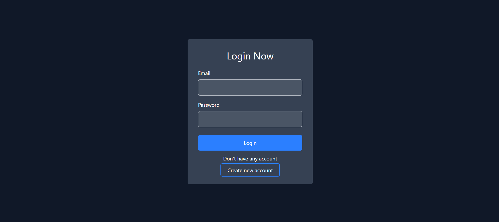
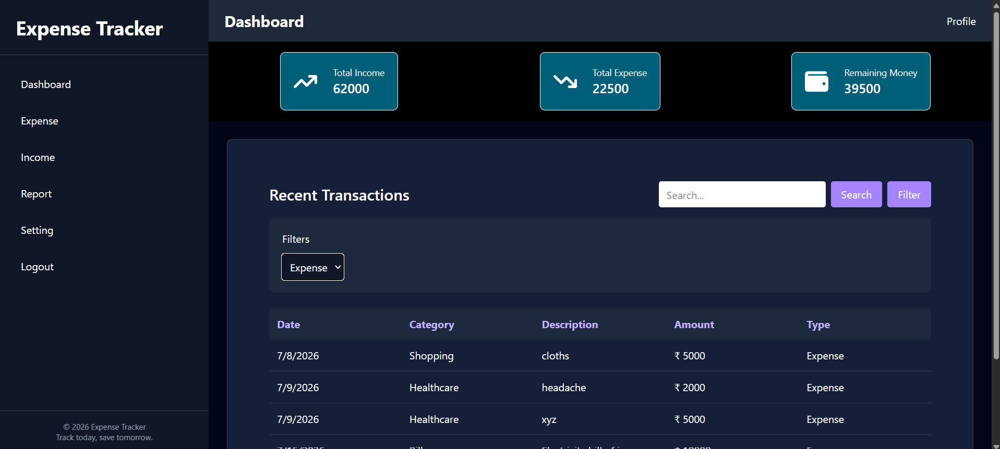
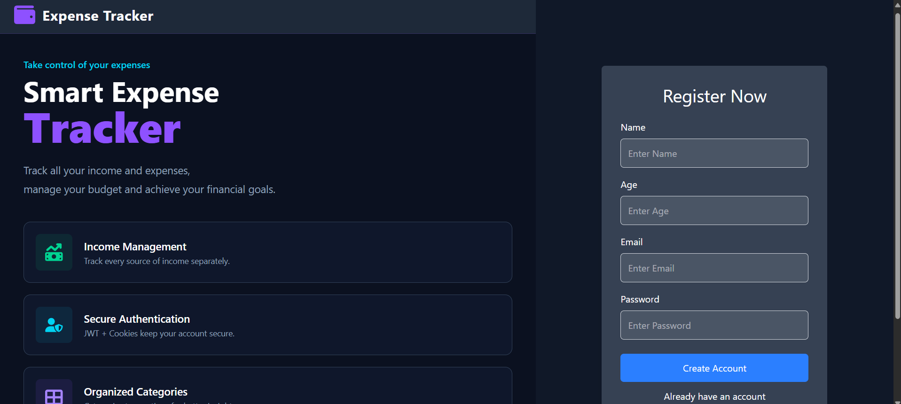

# 💰 Expense Tracker Frontend

A modern and responsive Expense Tracker web application built using **React.js** and **Vite**. This application allows users to securely manage their personal finances by tracking income and expenses, viewing reports, and analyzing spending patterns through an intuitive dashboard.

---

## 🚀 Tech Stack

- React.js
- Vite
- React Router DOM
- Tailwind CSS
- Recharts
- React Icons
- JavaScript (ES6+)

---

## ✨ Features

- 🔐 User Authentication (Login & Register)
- 🛡️ Protected Routes
- 📊 Dashboard Overview
- 💵 Add Income
- 💸 Add Expense
- 🔍 Search Transactions
- 📈 Reports & Charts
- 👤 User Profile & Settings
- 📱 Responsive User Interface

---

## 📂 Project Structure

```
Expense-Tracker-FE/
│
├── public/
├── src/
│   ├── assets/
│   ├── components/
│   ├── context/
│   ├── pages/
│   ├── App.jsx
│   ├── main.jsx
│   └── index.css
│
├── package.json
├── vite.config.js
├── .env
└── README.md
```

---

## ⚙️ Configuration Files

| File | Description |
|------|-------------|
| `package.json` | Project dependencies and scripts |
| `vite.config.js` | Vite configuration |
| `.env` | Environment variables |
| `README.md` | Project documentation |

---

## 🌐 Environment Variables

Create a `.env` file in the project root.

```env
VITE_API_URL=http://localhost:5000
```

> Update the URL according to your backend server.

---

## 💻 Run Locally

### 1. Clone the repository

```bash
git clone https://github.com/HarshVardhan-04/Expense-Tracker-FE.git
```

### 2. Navigate to the project

```bash
cd Expense-Tracker-FE
```

### 3. Install dependencies

```bash
npm install
```

### 4. Start the development server

```bash
npm run dev
```

The application will be available at:

```
http://localhost:5173
```

---

## 🔗 Backend Setup

Before running the frontend, make sure the backend server is running.

Default Backend URL:

```
http://localhost:5000
```

---

## 📜 Available Scripts

| Command | Description |
|---------|-------------|
| `npm install` | Install project dependencies |
| `npm run dev` | Start development server |
| `npm run build` | Create production build |
| `npm run preview` | Preview production build |

---

## 🌿 Default Branch

The primary development branch is:

```
main
```

---

## 📷 Screenshots

You can add screenshots of:

- Login Page
- Dashboard
- Expense Page
- Income Page
- Reports
- Settings

Example:

```
screenshots/
├── 
├── 
├── 
```

---

## 🤝 Contributing

1. Fork the repository.
2. Create a new feature branch.
3. Commit your changes.
4. Push the branch.
5. Open a Pull Request.

---

## 👨‍💻 Author

**Harsh Vardhan**

GitHub: https://github.com/HarshVardhan-04

---

## 📄 License

This project is intended for learning and portfolio purposes.